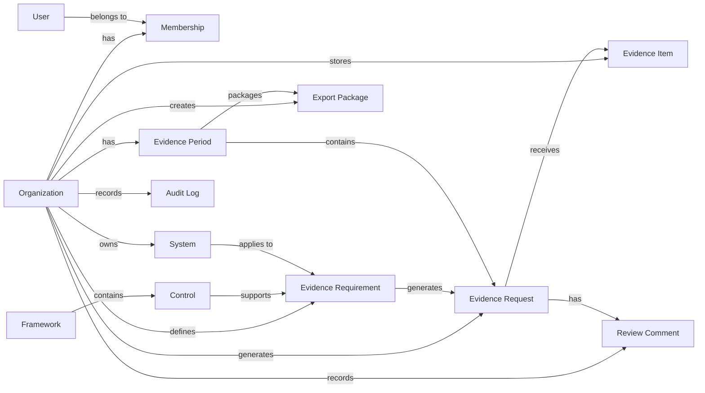

# EvidenceSnap Data Model

> Core data model for the SaaS-native EvidenceSnap prototype.

EvidenceSnap is a lightweight compliance evidence tracking platform. The data model should support the core evidence workflow:

```text
Define Evidence Requirement
        ↓
Generate Evidence Request
        ↓
Collect Evidence
        ↓
Review Evidence
        ↓
Track Readiness
        ↓
Export Evidence Package
```

This document defines the initial data model for the MVP and future evidence-as-code expansion.

---

<a id="table-of-contents"></a>

<details open>
<summary><strong>📚 Table of Contents</strong></summary>

- [1. Design Goals](#design-goals)
- [2. Core Entity Map](#core-entity-map)
- [3. Entity Relationship Overview](#entity-relationship-overview)
- [4. Tenant Isolation Model](#tenant-isolation-model)
- [5. Core Entities](#core-entities)
  - [Organization](#organization)
  - [User](#user)
  - [Membership](#membership)
  - [System](#system)
  - [Framework](#framework)
  - [Control](#control)
  - [Evidence Requirement](#evidence-requirement)
  - [Evidence Period](#evidence-period)
  - [Evidence Request](#evidence-request)
  - [Evidence Item](#evidence-item)
  - [Review Comment](#review-comment)
  - [Export Package](#export-package)
  - [Audit Log](#audit-log)
- [6. Recommended MVP Tables](#recommended-mvp-tables)
- [7. Status Models](#status-models)
- [8. Data Integrity Rules](#data-integrity-rules)
- [9. Audit Logging Requirements](#audit-logging-requirements)
- [10. File Storage Model](#file-storage-model)
- [11. Suggested PostgreSQL Schema Draft](#suggested-postgresql-schema-draft)
- [12. Future Data Model Extensions](#future-data-model-extensions)
- [13. Open Questions](#open-questions)

</details>

---

<a id="design-goals"></a>

## 1. Design Goals

The EvidenceSnap data model should be:

- **Tenant-safe**: every customer workspace is isolated by Organization ID.
- **Evidence-first**: the model centers on Evidence Requirements, Evidence Requests, Evidence Items, and Export Packages.
- **Auditable**: important actions are recorded in an Audit Log.
- **Portable**: data should be exportable and eventually representable as YAML/JSON evidence-as-code.
- **Simple enough for MVP**: avoid broad GRC complexity until the core evidence workflow is validated.
- **Future-compatible**: leave room for integrations, OSCAL mapping, versioning, and compliance-as-code features.

[Back to top](#table-of-contents)

---

<a id="core-entity-map"></a>

## 2. Core Entity Map

The initial MVP should use these core entities:

| Entity | Purpose |
|---|---|
| Organization | Customer tenant/workspace |
| User | Authenticated person |
| Membership | User-to-Organization relationship and role |
| System | Application, platform, environment, or compliance boundary |
| Framework | Compliance/security framework |
| Control | Individual requirement/control within a framework |
| Evidence Requirement | Definition of evidence that must be collected |
| Evidence Period | Reporting period such as a month, quarter, or assessment window |
| Evidence Request | Generated request for a specific requirement and period |
| Evidence Item | Submitted file, link, attestation, screenshot, report, or export |
| Review Comment | Reviewer/owner discussion on an Evidence Request |
| Export Package | Generated evidence package |
| Audit Log | Record of significant user/system actions |

[Back to top](#table-of-contents)

---

<a id="entity-relationship-overview"></a>

## 3. Entity Relationship Overview

High-level relationship model:

```text
Organization
├── Memberships
│   └── Users
├── Systems
├── Evidence Periods
├── Evidence Requirements
│   ├── Framework
│   ├── Control
│   └── System
├── Evidence Requests
│   ├── Evidence Requirement
│   ├── Evidence Period
│   ├── Control
│   ├── System
│   ├── Owner User
│   └── Reviewer User
├── Evidence Items
│   └── Evidence Request
├── Review Comments
│   └── Evidence Request
├── Export Packages
│   └── Evidence Period
└── Audit Logs
```

A simplified Mermaid diagram:



[Back to top](#table-of-contents)

---

<a id="tenant-isolation-model"></a>

## 4. Tenant Isolation Model

EvidenceSnap must be multi-tenant from the beginning.

Every tenant-scoped table should include:

```text
org_id
```

Tenant-scoped tables include:

- `systems`
- `evidence_requirements`
- `evidence_periods`
- `evidence_requests`
- `evidence_items`
- `review_comments`
- `export_packages`
- `audit_logs`

Some tables may be global or partially global:

- `frameworks`
- `controls`

However, MVP may keep `frameworks` and `controls` tenant-scoped if that is simpler for customization.

### Required Rule

Every tenant-scoped query must filter by `org_id`.

Example:

```sql
SELECT *
FROM evidence_requests
WHERE org_id = :current_org_id;
```

Do not rely on frontend filtering for tenant separation.

[Back to top](#table-of-contents)

---

<a id="core-entities"></a>

## 5. Core Entities

<a id="organization"></a>

### Organization

Represents a customer tenant or workspace.

#### Purpose

Organizations isolate data, users, evidence, exports, and settings.

#### Suggested Fields

| Field | Type | Notes |
|---|---|---|
| id | UUID | Primary key |
| name | Text | Organization name |
| slug | Text | URL-safe workspace identifier |
| plan | Text | Starter, Team, Compliance Ops, etc. |
| timezone | Text | Default organization timezone |
| primary_contact_email | Text | Optional |
| storage_region | Text | Future storage region support |
| created_at | Timestamp | Record creation |
| updated_at | Timestamp | Last update |
| deleted_at | Timestamp | Soft delete |
| active | Boolean | Active/inactive flag |

[Back to top](#table-of-contents)

---

<a id="user"></a>

### User

Represents an authenticated person.

#### Purpose

Users authenticate into the application and access one or more Organizations through Memberships.

#### Suggested Fields

| Field | Type | Notes |
|---|---|---|
| id | UUID | Primary key |
| email | Text | Unique login email |
| name | Text | Display name |
| avatar_url | Text | Optional |
| auth_provider | Text | Supabase, Clerk, Auth0, etc. |
| last_login_at | Timestamp | Optional |
| created_at | Timestamp | Record creation |
| updated_at | Timestamp | Last update |
| disabled_at | Timestamp | Optional |

[Back to top](#table-of-contents)

---

<a id="membership"></a>

### Membership

Represents a User’s access to an Organization.

#### Purpose

Membership supports role-based access control and future multi-organization users.

#### Suggested Roles

- Admin
- Compliance Manager
- Evidence Owner
- Reviewer
- Auditor / Read-only

#### Suggested Fields

| Field | Type | Notes |
|---|---|---|
| id | UUID | Primary key |
| org_id | UUID | References Organization |
| user_id | UUID | References User |
| role | Text | Role enum |
| status | Text | Invited, Active, Disabled |
| invited_by_user_id | UUID | Optional |
| invited_at | Timestamp | Optional |
| accepted_at | Timestamp | Optional |
| created_at | Timestamp | Record creation |
| updated_at | Timestamp | Last update |

[Back to top](#table-of-contents)

---

<a id="system"></a>

### System

Represents an application, infrastructure environment, platform, or compliance boundary.

#### Examples

- Corporate IT
- AWS Production
- Microsoft 365 Tenant
- Google Workspace
- Internal SaaS Platform

#### Suggested Fields

| Field | Type | Notes |
|---|---|---|
| id | UUID | Primary key |
| org_id | UUID | Tenant ID |
| name | Text | System name |
| description | Text | Optional |
| owner_user_id | UUID | Optional owner |
| environment | Text | Production, Corporate, Dev, etc. |
| criticality | Text | Low, Moderate, High |
| active | Boolean | Active/inactive |
| created_at | Timestamp | Record creation |
| updated_at | Timestamp | Last update |
| deleted_at | Timestamp | Soft delete |

[Back to top](#table-of-contents)

---

<a id="framework"></a>

### Framework

Represents a compliance or security framework.

#### Examples

- CMMC Level 1
- CMMC Level 2
- NIST 800-171
- SOC 2 Security
- Custom Internal Controls

#### Suggested Fields

| Field | Type | Notes |
|---|---|---|
| id | UUID | Primary key |
| org_id | UUID | Optional for tenant-custom frameworks |
| name | Text | Framework name |
| version | Text | Version/revision |
| source | Text | NIST, DoD, AICPA, Custom, etc. |
| description | Text | Optional |
| active | Boolean | Active/inactive |
| created_at | Timestamp | Record creation |
| updated_at | Timestamp | Last update |

#### MVP Note

For MVP, frameworks may be manually created or imported from a simple CSV/YAML seed file.

[Back to top](#table-of-contents)

---

<a id="control"></a>

### Control

Represents a specific requirement from a Framework.

#### Examples

- AC-2
- IA-2
- CM-8
- RA-5

#### Suggested Fields

| Field | Type | Notes |
|---|---|---|
| id | UUID | Primary key |
| framework_id | UUID | References Framework |
| code | Text | Control code |
| name | Text | Control title |
| family | Text | Control family/category |
| text | Text | Control statement |
| objective | Text | Optional |
| implementation_guidance | Text | Optional |
| sort_order | Integer | Display order |
| active | Boolean | Active/inactive |
| created_at | Timestamp | Record creation |
| updated_at | Timestamp | Last update |

[Back to top](#table-of-contents)

---

<a id="evidence-requirement"></a>

### Evidence Requirement

Defines what evidence must be collected.

This is one of the most important entities in EvidenceSnap.

#### Purpose

Evidence Requirements connect controls, systems, owners, reviewers, frequencies, and expected evidence types.

#### Example

> Monthly MFA status export for all active users.

#### Suggested Fields

| Field | Type | Notes |
|---|---|---|
| id | UUID | Primary key |
| org_id | UUID | Tenant ID |
| control_id | UUID | References Control |
| system_id | UUID | References System |
| name | Text | Requirement name |
| description | Text | Instructions |
| evidence_type | Text | Screenshot, CSV, PDF, Link, Attestation, etc. |
| frequency | Text | Monthly, Quarterly, Annual, One-time, etc. |
| owner_user_id | UUID | Default owner |
| reviewer_user_id | UUID | Default reviewer |
| due_day | Integer | Day of month for recurring requests |
| grace_days | Integer | Optional |
| required | Boolean | Required vs optional |
| active | Boolean | Active/inactive |
| version | Text | Evidence requirement version |
| tags | Text[] | Optional |
| validation_rules_json | JSONB | Future evidence-as-code validation |
| created_at | Timestamp | Record creation |
| updated_at | Timestamp | Last update |
| deleted_at | Timestamp | Soft delete |

[Back to top](#table-of-contents)

---

<a id="evidence-period"></a>

### Evidence Period

Represents a reporting window.

#### Examples

- May 2026
- Q2 2026
- FY2026
- Assessment Window 1

#### Suggested Fields

| Field | Type | Notes |
|---|---|---|
| id | UUID | Primary key |
| org_id | UUID | Tenant ID |
| name | Text | Period name |
| start_date | Date | Period start |
| end_date | Date | Period end |
| status | Text | Open, In Review, Complete, Locked, Archived |
| created_at | Timestamp | Record creation |
| updated_at | Timestamp | Last update |
| closed_at | Timestamp | Optional |
| locked_at | Timestamp | Optional |

[Back to top](#table-of-contents)

---

<a id="evidence-request"></a>

### Evidence Request

Represents a generated request for evidence for a specific Evidence Requirement and Evidence Period.

#### Example

> May 2026 MFA Status Export due June 5.

#### Suggested Fields

| Field | Type | Notes |
|---|---|---|
| id | UUID | Primary key |
| org_id | UUID | Tenant ID |
| evidence_requirement_id | UUID | References Evidence Requirement |
| evidence_period_id | UUID | References Evidence Period |
| control_id | UUID | Denormalized for query/export |
| system_id | UUID | Denormalized for query/export |
| owner_user_id | UUID | Assigned owner |
| reviewer_user_id | UUID | Assigned reviewer |
| due_date | Date | Due date |
| status | Text | Requested, Submitted, Approved, etc. |
| requested_at | Timestamp | When generated/requested |
| submitted_at | Timestamp | When first submitted |
| reviewed_at | Timestamp | When reviewed |
| last_reminder_at | Timestamp | Optional |
| reminder_count | Integer | Optional |
| waiver_reason | Text | Optional |
| not_applicable_reason | Text | Optional |
| created_at | Timestamp | Record creation |
| updated_at | Timestamp | Last update |

[Back to top](#table-of-contents)

---

<a id="evidence-item"></a>

### Evidence Item

Represents submitted evidence.

#### Evidence Item Types

- File upload
- External URL
- Attestation
- Screenshot
- CSV export
- PDF report
- Policy/procedure document
- Vulnerability scan
- Access review
- Inventory export

#### Suggested Fields

| Field | Type | Notes |
|---|---|---|
| id | UUID | Primary key |
| org_id | UUID | Tenant ID |
| evidence_request_id | UUID | References Evidence Request |
| file_name | Text | Original file name |
| file_type | Text | MIME/file type |
| file_size | BigInt | Size in bytes |
| storage_path | Text | Private object storage path |
| external_url | Text | If link-based evidence |
| sha256_hash | Text | File hash |
| description | Text | Submitter notes |
| evidence_date | Date | Date evidence represents |
| source_system | Text | Optional |
| uploaded_by_user_id | UUID | References User |
| uploaded_at | Timestamp | Upload time |
| created_at | Timestamp | Record creation |
| updated_at | Timestamp | Last update |
| deleted_at | Timestamp | Soft delete |

[Back to top](#table-of-contents)

---

<a id="review-comment"></a>

### Review Comment

Represents discussion, notes, or feedback on an Evidence Request.

#### Suggested Fields

| Field | Type | Notes |
|---|---|---|
| id | UUID | Primary key |
| org_id | UUID | Tenant ID |
| evidence_request_id | UUID | References Evidence Request |
| user_id | UUID | Comment author |
| comment | Text | Comment body |
| visibility | Text | Internal, OwnerVisible, AuditorVisible |
| created_at | Timestamp | Record creation |
| updated_at | Timestamp | Last update |
| deleted_at | Timestamp | Soft delete |

[Back to top](#table-of-contents)

---

<a id="export-package"></a>

### Export Package

Represents a generated package of evidence files and supporting reports.

#### Suggested Fields

| Field | Type | Notes |
|---|---|---|
| id | UUID | Primary key |
| org_id | UUID | Tenant ID |
| evidence_period_id | UUID | References Evidence Period |
| framework_id | UUID | Optional |
| system_id | UUID | Optional |
| name | Text | Package name |
| status | Text | Pending, Generating, Ready, Failed |
| storage_path | Text | Package location |
| generated_by_user_id | UUID | References User |
| generated_at | Timestamp | Package generation time |
| evidence_count | Integer | Included evidence count |
| missing_count | Integer | Missing evidence count |
| include_audit_log | Boolean | Export option |
| include_missing_report | Boolean | Export option |
| created_at | Timestamp | Record creation |
| updated_at | Timestamp | Last update |

[Back to top](#table-of-contents)

---

<a id="audit-log"></a>

### Audit Log

Records significant user and system actions.

#### Purpose

Audit Logs support traceability, export history, security review, and future compliance reporting.

#### Suggested Fields

| Field | Type | Notes |
|---|---|---|
| id | UUID | Primary key |
| org_id | UUID | Tenant ID |
| actor_user_id | UUID | User who performed action |
| action | Text | Created, Updated, Uploaded, Approved, etc. |
| entity_type | Text | EvidenceRequest, EvidenceItem, etc. |
| entity_id | UUID | Affected entity |
| before_json | JSONB | Optional previous state |
| after_json | JSONB | Optional new state |
| ip_address | Text | Optional |
| user_agent | Text | Optional |
| created_at | Timestamp | Log timestamp |

#### Suggested Actions

- Created
- Updated
- Deleted
- Uploaded
- Submitted
- Approved
- Rejected
- Waived
- MarkedNotApplicable
- Exported
- Login
- PermissionChanged

[Back to top](#table-of-contents)

---

<a id="recommended-mvp-tables"></a>

## 6. Recommended MVP Tables

The MVP should start with the following tables:

```text
organizations
users
memberships
systems
frameworks
controls
evidence_requirements
evidence_periods
evidence_requests
evidence_items
review_comments
export_packages
audit_logs
```

Optional early tables:

```text
invitations
notifications
email_events
template_packs
```

Defer these tables until later:

```text
risks
policies
vendors
integrations
scanner_findings
oscal_exports
compliance_repositories
```

[Back to top](#table-of-contents)

---

<a id="status-models"></a>

## 7. Status Models

### Evidence Period Status

| Status | Meaning |
|---|---|
| Open | Evidence collection is active |
| In Review | Collection mostly complete; review in progress |
| Complete | Period completed |
| Locked | Period is locked against changes |
| Archived | Historical period |

### Evidence Request Status

| Status | Meaning |
|---|---|
| Draft | Created but not yet requested |
| Requested | Request sent or active |
| Submitted | Evidence submitted and awaiting review |
| Needs Changes | Reviewer rejected or requested correction |
| Approved | Reviewer accepted evidence |
| Waived | Requirement waived with reason |
| Overdue | Due date passed without acceptable submission |
| Not Applicable | Requirement marked not applicable with reason |

### Export Package Status

| Status | Meaning |
|---|---|
| Pending | Package requested |
| Generating | Package generation in progress |
| Ready | Package available for download |
| Failed | Generation failed |

[Back to top](#table-of-contents)

---

<a id="data-integrity-rules"></a>

## 8. Data Integrity Rules

### Tenant Integrity

- All tenant-scoped records must include `org_id`.
- Child records must belong to the same `org_id` as their parent records.
- Application and database policies should enforce tenant isolation.

### Evidence Request Generation

When generating Evidence Requests:

- Use active Evidence Requirements only.
- Generate requests for a specific Evidence Period.
- Copy key references onto the request:
  - `control_id`
  - `system_id`
  - `owner_user_id`
  - `reviewer_user_id`
- Avoid duplicate requests for the same:
  - `org_id`
  - `evidence_requirement_id`
  - `evidence_period_id`

### Evidence Submission

- Evidence Items should always link to an Evidence Request.
- Uploaded files should store:
  - original filename
  - file size
  - MIME type
  - storage path
  - SHA-256 hash
  - uploader
  - upload timestamp

### Review

- Approval/rejection should update Evidence Request status.
- Rejection should require a comment or reason.
- Waiver should require a reason.
- Not Applicable should require a reason.

### Export

- Export Packages should log:
  - who generated the package
  - when it was generated
  - what period/framework/system it covered
  - evidence count
  - missing count
  - storage path
- Export generation should create an Audit Log event.

[Back to top](#table-of-contents)

---

<a id="audit-logging-requirements"></a>

## 9. Audit Logging Requirements

Audit logging is mandatory for trust and traceability.

### Events to Log in MVP

- User invited
- User role changed
- System created/updated/deleted
- Framework created/imported
- Control created/imported
- Evidence Requirement created/updated/deactivated
- Evidence Period created/locked/closed
- Evidence Request generated
- Evidence Item uploaded
- Evidence Request submitted
- Evidence Request approved
- Evidence Request rejected
- Evidence Request waived
- Evidence Request marked not applicable
- Export Package generated
- Export Package downloaded, if feasible

### Audit Log Format

Recommended audit message shape:

```json
{
  "org_id": "uuid",
  "actor_user_id": "uuid",
  "action": "Approved",
  "entity_type": "EvidenceRequest",
  "entity_id": "uuid",
  "before_json": {},
  "after_json": {},
  "created_at": "2026-05-12T12:00:00Z"
}
```

[Back to top](#table-of-contents)

---

<a id="file-storage-model"></a>

## 10. File Storage Model

Evidence files should be stored in private object storage.

Suggested storage providers:

- S3
- Cloudflare R2
- Supabase Storage
- Azure Blob Storage

### Storage Path Pattern

```text
/orgs/{org_id}/evidence/{period_id}/{request_id}/{evidence_item_id}/{filename}
```

### Export Package Path Pattern

```text
/orgs/{org_id}/exports/{period_id}/{export_package_id}/package.zip
```

### File Access Rules

- Files should not be public.
- Downloads should use signed URLs.
- Signed URLs should expire.
- Access should be checked before URL generation.
- File downloads should be logged if feasible.

[Back to top](#table-of-contents)

---

<a id="suggested-postgresql-schema-draft"></a>

## 11. Suggested PostgreSQL Schema Draft

This is a rough draft for architecture planning. It is not final production SQL.

```sql
CREATE TABLE organizations (
    id UUID PRIMARY KEY,
    name TEXT NOT NULL,
    slug TEXT UNIQUE NOT NULL,
    plan TEXT NOT NULL DEFAULT 'starter',
    timezone TEXT NOT NULL DEFAULT 'UTC',
    primary_contact_email TEXT,
    storage_region TEXT,
    active BOOLEAN NOT NULL DEFAULT TRUE,
    created_at TIMESTAMPTZ NOT NULL DEFAULT now(),
    updated_at TIMESTAMPTZ NOT NULL DEFAULT now(),
    deleted_at TIMESTAMPTZ
);

CREATE TABLE users (
    id UUID PRIMARY KEY,
    email TEXT UNIQUE NOT NULL,
    name TEXT,
    avatar_url TEXT,
    auth_provider TEXT,
    last_login_at TIMESTAMPTZ,
    created_at TIMESTAMPTZ NOT NULL DEFAULT now(),
    updated_at TIMESTAMPTZ NOT NULL DEFAULT now(),
    disabled_at TIMESTAMPTZ
);

CREATE TABLE memberships (
    id UUID PRIMARY KEY,
    org_id UUID NOT NULL REFERENCES organizations(id),
    user_id UUID NOT NULL REFERENCES users(id),
    role TEXT NOT NULL,
    status TEXT NOT NULL DEFAULT 'active',
    invited_by_user_id UUID REFERENCES users(id),
    invited_at TIMESTAMPTZ,
    accepted_at TIMESTAMPTZ,
    created_at TIMESTAMPTZ NOT NULL DEFAULT now(),
    updated_at TIMESTAMPTZ NOT NULL DEFAULT now(),
    UNIQUE (org_id, user_id)
);

CREATE TABLE systems (
    id UUID PRIMARY KEY,
    org_id UUID NOT NULL REFERENCES organizations(id),
    name TEXT NOT NULL,
    description TEXT,
    owner_user_id UUID REFERENCES users(id),
    environment TEXT,
    criticality TEXT,
    active BOOLEAN NOT NULL DEFAULT TRUE,
    created_at TIMESTAMPTZ NOT NULL DEFAULT now(),
    updated_at TIMESTAMPTZ NOT NULL DEFAULT now(),
    deleted_at TIMESTAMPTZ
);

CREATE TABLE frameworks (
    id UUID PRIMARY KEY,
    org_id UUID REFERENCES organizations(id),
    name TEXT NOT NULL,
    version TEXT,
    source TEXT,
    description TEXT,
    active BOOLEAN NOT NULL DEFAULT TRUE,
    created_at TIMESTAMPTZ NOT NULL DEFAULT now(),
    updated_at TIMESTAMPTZ NOT NULL DEFAULT now()
);

CREATE TABLE controls (
    id UUID PRIMARY KEY,
    framework_id UUID NOT NULL REFERENCES frameworks(id),
    code TEXT NOT NULL,
    name TEXT NOT NULL,
    family TEXT,
    text TEXT,
    objective TEXT,
    implementation_guidance TEXT,
    sort_order INTEGER,
    active BOOLEAN NOT NULL DEFAULT TRUE,
    created_at TIMESTAMPTZ NOT NULL DEFAULT now(),
    updated_at TIMESTAMPTZ NOT NULL DEFAULT now(),
    UNIQUE (framework_id, code)
);

CREATE TABLE evidence_requirements (
    id UUID PRIMARY KEY,
    org_id UUID NOT NULL REFERENCES organizations(id),
    control_id UUID NOT NULL REFERENCES controls(id),
    system_id UUID NOT NULL REFERENCES systems(id),
    name TEXT NOT NULL,
    description TEXT,
    evidence_type TEXT NOT NULL,
    frequency TEXT NOT NULL,
    owner_user_id UUID REFERENCES users(id),
    reviewer_user_id UUID REFERENCES users(id),
    due_day INTEGER,
    grace_days INTEGER DEFAULT 0,
    required BOOLEAN NOT NULL DEFAULT TRUE,
    active BOOLEAN NOT NULL DEFAULT TRUE,
    version TEXT NOT NULL DEFAULT '1.0',
    tags TEXT[],
    validation_rules_json JSONB,
    created_at TIMESTAMPTZ NOT NULL DEFAULT now(),
    updated_at TIMESTAMPTZ NOT NULL DEFAULT now(),
    deleted_at TIMESTAMPTZ
);

CREATE TABLE evidence_periods (
    id UUID PRIMARY KEY,
    org_id UUID NOT NULL REFERENCES organizations(id),
    name TEXT NOT NULL,
    start_date DATE NOT NULL,
    end_date DATE NOT NULL,
    status TEXT NOT NULL DEFAULT 'open',
    created_at TIMESTAMPTZ NOT NULL DEFAULT now(),
    updated_at TIMESTAMPTZ NOT NULL DEFAULT now(),
    closed_at TIMESTAMPTZ,
    locked_at TIMESTAMPTZ
);

CREATE TABLE evidence_requests (
    id UUID PRIMARY KEY,
    org_id UUID NOT NULL REFERENCES organizations(id),
    evidence_requirement_id UUID NOT NULL REFERENCES evidence_requirements(id),
    evidence_period_id UUID NOT NULL REFERENCES evidence_periods(id),
    control_id UUID NOT NULL REFERENCES controls(id),
    system_id UUID NOT NULL REFERENCES systems(id),
    owner_user_id UUID REFERENCES users(id),
    reviewer_user_id UUID REFERENCES users(id),
    due_date DATE,
    status TEXT NOT NULL DEFAULT 'requested',
    requested_at TIMESTAMPTZ,
    submitted_at TIMESTAMPTZ,
    reviewed_at TIMESTAMPTZ,
    last_reminder_at TIMESTAMPTZ,
    reminder_count INTEGER NOT NULL DEFAULT 0,
    waiver_reason TEXT,
    not_applicable_reason TEXT,
    created_at TIMESTAMPTZ NOT NULL DEFAULT now(),
    updated_at TIMESTAMPTZ NOT NULL DEFAULT now(),
    UNIQUE (org_id, evidence_requirement_id, evidence_period_id)
);

CREATE TABLE evidence_items (
    id UUID PRIMARY KEY,
    org_id UUID NOT NULL REFERENCES organizations(id),
    evidence_request_id UUID NOT NULL REFERENCES evidence_requests(id),
    file_name TEXT,
    file_type TEXT,
    file_size BIGINT,
    storage_path TEXT,
    external_url TEXT,
    sha256_hash TEXT,
    description TEXT,
    evidence_date DATE,
    source_system TEXT,
    uploaded_by_user_id UUID REFERENCES users(id),
    uploaded_at TIMESTAMPTZ,
    created_at TIMESTAMPTZ NOT NULL DEFAULT now(),
    updated_at TIMESTAMPTZ NOT NULL DEFAULT now(),
    deleted_at TIMESTAMPTZ
);

CREATE TABLE review_comments (
    id UUID PRIMARY KEY,
    org_id UUID NOT NULL REFERENCES organizations(id),
    evidence_request_id UUID NOT NULL REFERENCES evidence_requests(id),
    user_id UUID NOT NULL REFERENCES users(id),
    comment TEXT NOT NULL,
    visibility TEXT NOT NULL DEFAULT 'owner_visible',
    created_at TIMESTAMPTZ NOT NULL DEFAULT now(),
    updated_at TIMESTAMPTZ NOT NULL DEFAULT now(),
    deleted_at TIMESTAMPTZ
);

CREATE TABLE export_packages (
    id UUID PRIMARY KEY,
    org_id UUID NOT NULL REFERENCES organizations(id),
    evidence_period_id UUID NOT NULL REFERENCES evidence_periods(id),
    framework_id UUID REFERENCES frameworks(id),
    system_id UUID REFERENCES systems(id),
    name TEXT NOT NULL,
    status TEXT NOT NULL DEFAULT 'pending',
    storage_path TEXT,
    generated_by_user_id UUID REFERENCES users(id),
    generated_at TIMESTAMPTZ,
    evidence_count INTEGER DEFAULT 0,
    missing_count INTEGER DEFAULT 0,
    include_audit_log BOOLEAN NOT NULL DEFAULT TRUE,
    include_missing_report BOOLEAN NOT NULL DEFAULT TRUE,
    created_at TIMESTAMPTZ NOT NULL DEFAULT now(),
    updated_at TIMESTAMPTZ NOT NULL DEFAULT now()
);

CREATE TABLE audit_logs (
    id UUID PRIMARY KEY,
    org_id UUID NOT NULL REFERENCES organizations(id),
    actor_user_id UUID REFERENCES users(id),
    action TEXT NOT NULL,
    entity_type TEXT NOT NULL,
    entity_id UUID,
    before_json JSONB,
    after_json JSONB,
    ip_address TEXT,
    user_agent TEXT,
    created_at TIMESTAMPTZ NOT NULL DEFAULT now()
);
```

[Back to top](#table-of-contents)

---

<a id="future-data-model-extensions"></a>

## 12. Future Data Model Extensions

Future entities may include:

| Entity | Purpose |
|---|---|
| Template Pack | Bundled evidence-as-code templates |
| Requirement Version | Immutable history of Evidence Requirement changes |
| Integration | External system connector |
| Evidence Collector | Automated collection job definition |
| Scanner Import | Vulnerability/security scanner evidence import |
| Control Mapping | Crosswalk between frameworks |
| Compliance Repository | Git-backed compliance configuration |
| OSCAL Export | OSCAL-aligned export package |
| Policy Document | Future policy management |
| Risk Register | Future GRC expansion |
| Vendor | Future vendor risk workflows |

[Back to top](#table-of-contents)

---

<a id="open-questions"></a>

## 13. Open Questions

- Should `frameworks` and `controls` be global, tenant-scoped, or hybrid?
- Should Evidence Requirements support multiple controls in MVP, or exactly one control?
- Should Evidence Requests support multiple Evidence Items, or should one item be primary?
- Should role-based permissions be implemented in the app layer, database layer, or both?
- Should audit logs store full before/after JSON for every update or only selected fields?
- Should export package contents be stored as a manifest table?
- Should file download events be logged in MVP?
- Should Evidence Requirement versions be separate records in MVP or just a `version` field?

[Back to top](#table-of-contents)